# DailyProof
기간 : 2026.05.27 ~ 2026.06.22

  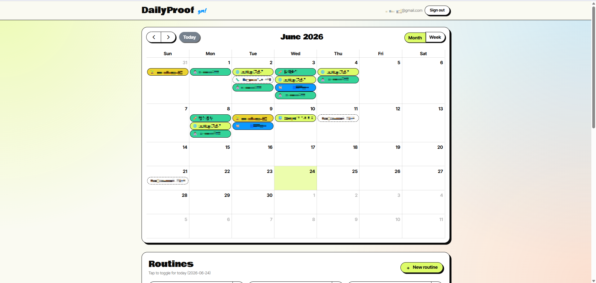

# 1. 프로젝트 소개

DailyProof는 원래 `Next.js + Supabase` 기반의 routine-tracking 웹앱이다. 캘린더에 루틴을 기록하고, 날짜별로 리치 텍스트 페이지를 남길 수 있는 구조이다.  
하지만 단순 CRUD 앱만으로는 **장애, 확장, 복구 같은 운영 이슈**를 관리하기 어려웠다.

그래서 이 프로젝트를 `업로드 → 비동기 처리 → 관측 → 배포 → 보안 → 복구`가 이어지는 운영형 서비스로 확장했다.  
이미지 업로드 이후 `proof_assets`와 `jobs`를 생성하고, 별도 `worker`가 후처리를 수행하며, Kubernetes·GitOps·관측성·보안 정책까지 연결한 프로젝트다.

# 2. 프로젝트 목적

- 단순 웹앱 개발 경험이 아니라 `운영 가능한 서비스로 확장한 경험`을 보여준다.
- 이미지 업로드와 비동기 처리 파이프라인을 통해 queue, retry, failed job, recovery 같은 운영 이슈를 만든다.
- 배포 자동화, GitOps, 관측성, 보안 정책, 백업/복구까지 실제 구현 가능한 범위에서 최대한 직접 구축한다.

# 3. 프로젝트 문제의식

- 기존 구조에서는 업로드 이후 작업이 어느 단계에 있는지 바로 확인하기 어려웠다.
- 실패한 작업을 재시도할지 종료할지 판단하는 기준도 없었고, 작업 상태 전이도 분명하지 않았다.
- 배포 후 서비스가 정상 상태인지 빠르게 확인할 health check와 검증 절차도 부족했다.
- 로그, 지표, tracing 기준이 없어 문제가 생겨도 어느 단계와 실행 환경에서 실패했는지 좁혀가기 어려웠다.
- 그래서 기능을 더 늘리기보다, 업로드 이후 흐름이 끊기지 않도록 `상태 추적`, `비동기 처리`, `관측`, `복구`, `배포 검증` 구조를 먼저 보강하는 방향으로 확장했다.

# 4. 프로젝트 서비스

### (1) 아키텍처

  

  
Mermaid 원본 코드 보기

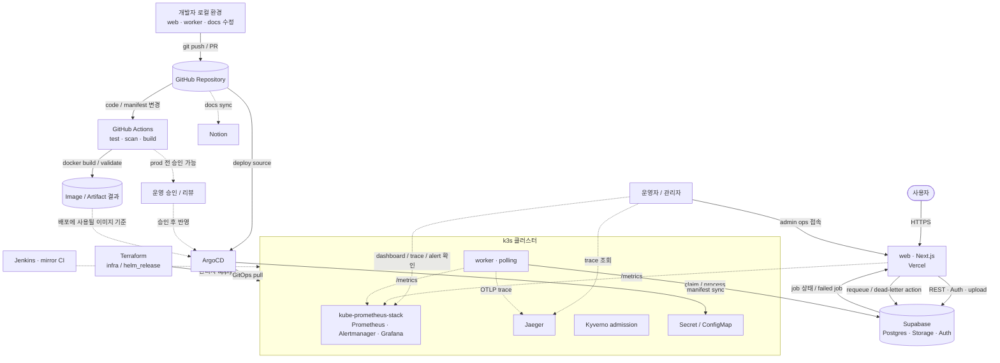

### (2) 서비스 흐름

- 사용자가 이미지를 업로드하면 `web`이 `proof_assets`와 `jobs` 레코드를 생성한다.
- `worker`는 Postgres job queue를 polling 하며 작업을 claim한다.
- worker는 메타데이터 추출, thumbnail 생성, checksum 생성, 상태 전이를 수행한다.
- 결과는 DB에 기록되고, 운영자는 `/admin/ops`에서 failed/stuck job을 조회하고 재처리할 수 있다.
- 운영자는 Grafana, Jaeger, admin ops를 함께 보면서 장애 징후를 확인하고, 필요 시 requeue / dead-letter 정리 같은 조치를 수행한다.

### (3) 개발부터 배포까지의 흐름

- 개발자가 로컬에서 `web`, `worker`, `docs`를 수정한 뒤 GitHub로 push한다.
- GitHub Actions가 테스트, 보안 스캔, 이미지 빌드, Helm/Terraform 검증을 수행한다.
- 문서 변경은 별도 workflow를 통해 Notion에도 동기화된다.
- 배포 리소스 변경은 ArgoCD가 GitHub repo를 source of truth로 삼아 k3s에 반영한다.
- 운영상 위험한 변경은 승인 절차를 거친 뒤 반영할 수 있고, 인프라 변경은 Terraform apply 같은 별도 실행 단계로 관리한다.
- 시크릿과 런타임 설정은 Docker image 안에 고정하지 않고 Secret / ConfigMap / 플랫폼 환경변수로 주입한다.

### (4) 자동화와 운영 통제의 구분

- `git push`만으로 항상 모든 환경이 새로 만들어지는 것은 아니다.
- 코드 변경, 테스트, 이미지 빌드, 문서 동기화는 자동화하기 쉽고 현재도 자동화 범위에 들어간다.
- 반면 운영 시크릿, 인프라 생성·변경, production 반영은 보통 승인이나 별도 실행 절차를 둔다.
- 이 프로젝트도 그 현실을 반영해 `CI 자동화`, `GitOps 배포`, `Terraform 기반 인프라`, `Secret 분리 주입`을 나눠 표현했다.

### (5) 핵심 기능

#### - App / User

- 회원가입 / 로그인 / 로그아웃
- 캘린더 기반 루틴 기록
- 날짜별 리치 텍스트 페이지 작성
- 이미지 업로드 및 private media proxy
- tracker 기반 activity graph 공개 임베드

#### - Back-End / Worker

- `proof_assets` / `jobs` 비동기 파이프라인
- worker polling + retry + dead-letter 처리
- 업로드 후 메타데이터 추출, thumbnail 생성, checksum 생성
- failed job 재처리 및 운영용 admin action

# 5. DevOps 구현 항목

### (1) CI/CD

- GitHub Actions 기반 CI
- typecheck / lint / test / security scan / image build
- Notion sync workflow
- Jenkins mirror pipeline 병행

### (2) Kubernetes + GitOps

- Docker image 빌드
- Helm chart 기반 배포
- k3s 환경 구성
- ArgoCD sync / PostSync smoke job / revision rollback
- Terraform `helm_release` 기반 IaC

  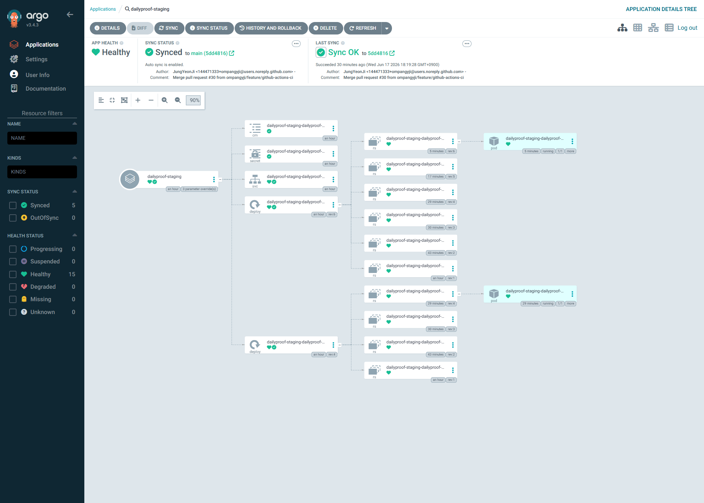

### (3) Observability

- OpenTelemetry trace → Jaeger
- `/metrics` 노출 → Prometheus scrape
- Grafana dashboard / Alertmanager alert
- 구조화 JSON 로그
- request id / trace id 전파

#### - Jaeger

업로드 요청이 `web`에서 시작해 `worker` 후처리까지 하나의 trace로 이어지는지 확인했다.

  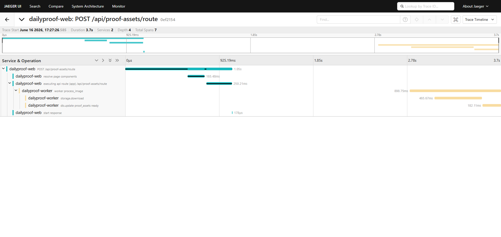

  Jaeger에서 web 요청과 worker 후처리 span이 하나의 trace tree로 연결된 모습

#### - Prometheus

보안 이벤트 메트릭이 실제로 쌓이고, 그 값을 기준으로 경고 조건이 올라가는지 확인했다.

  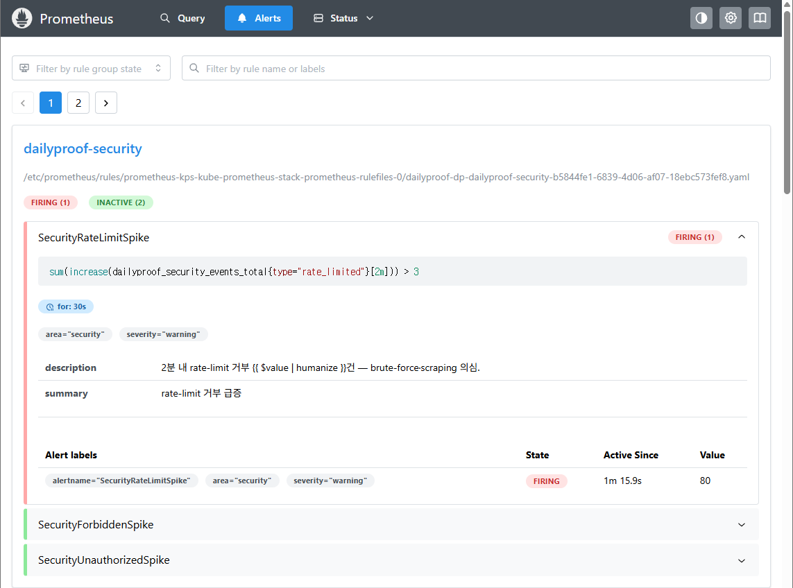

  Prometheus 규칙이 보안 이벤트 급증을 감지해 alert가 firing 상태로 올라온 모습

#### - Grafana

수집된 메트릭을 대시보드에서 시각화해 운영자가 증가 추세를 바로 확인할 수 있도록 했다.

  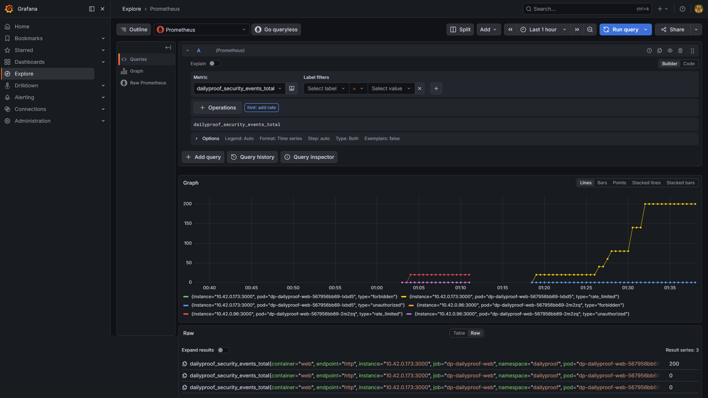

  Grafana에서 보안 관련 메트릭이 시계열로 시각화된 화면

#### - Alertmanager

경고가 실제 운영 알림 채널까지 전달되는지 확인해 탐지 이후 대응 흐름도 검증했다.

  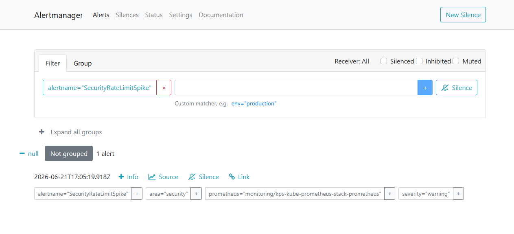

  Alertmanager가 firing 된 보안 경고를 수신한 화면

### (4) Security

- Supabase RLS + private bucket 정책
- MIME / file size 제한
- Zod 입력 검증
- rate limiting
- CSP nonce + security headers
- sealed-secrets
- default-deny NetworkPolicy
- Kyverno admission policy

#### - 입력 검증과 업로드 게이트

업로드 API에서 잘못된 입력과 권한 없는 요청을 먼저 차단하고, Storage 레벨에서도 MIME / 파일 크기 제한이 일치하도록 맞췄다.

  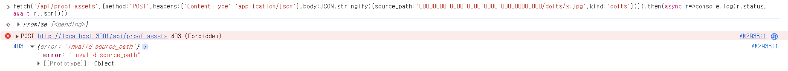

  다른 사용자의 asset에 접근하려는 요청이 API 레벨에서 403으로 차단된 화면

  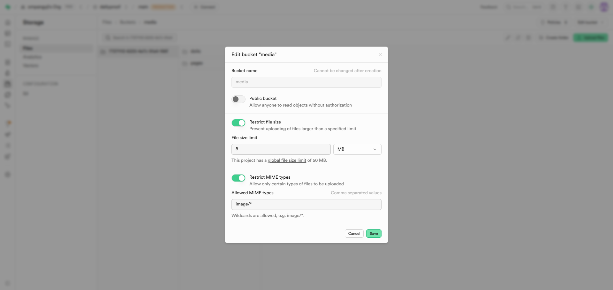

  Supabase Storage 버킷에 허용 MIME 타입과 파일 크기 제한을 설정한 화면

#### - Rate limiting

짧은 시간에 과도한 요청이 들어오면 429로 차단하고, 보안 이벤트 메트릭에도 반영되도록 구성했다.

  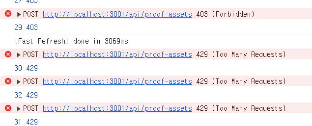

  proof-assets 엔드포인트에 대한 과도한 요청이 429로 거부된 화면

#### - Security headers / CSP

CSP nonce와 보안 헤더를 적용해 브라우저 레벨 보호를 강화하고, 설정 전후 차이를 점검했다.

  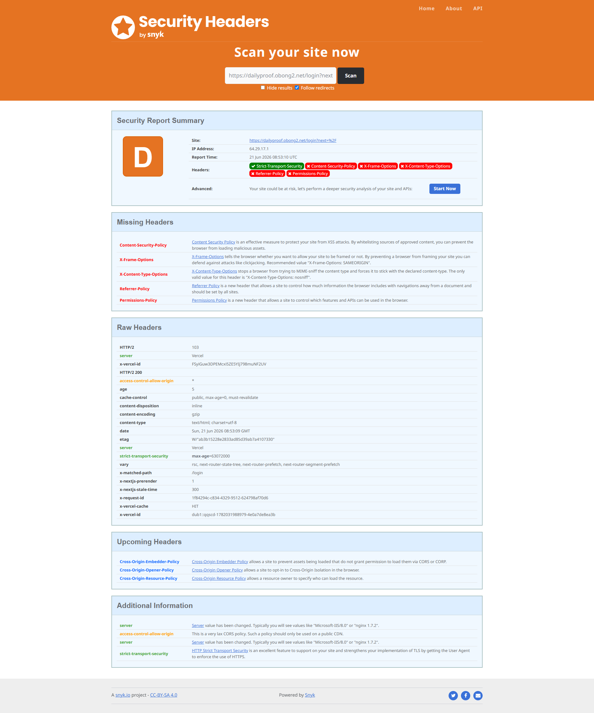
  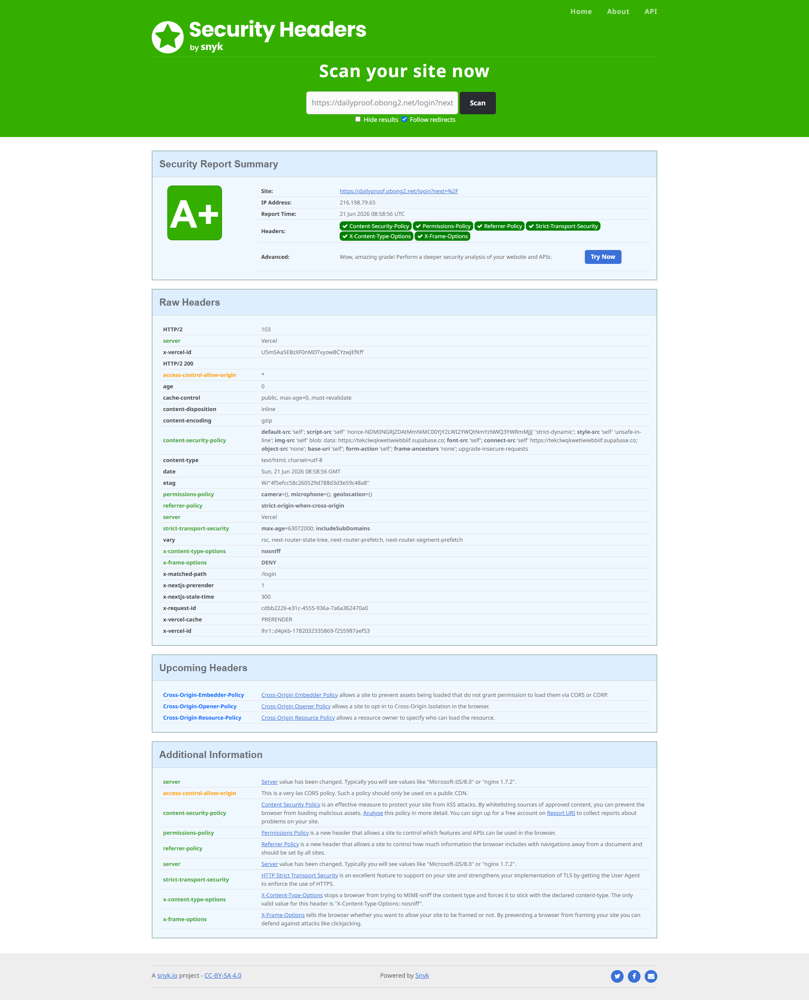

  좌: 보안 헤더 적용 전 결과 / 우: CSP nonce와 보안 헤더 적용 후 강화된 결과

#### - Secret 관리

시크릿은 코드나 일반 values 파일에 넣지 않고 sealed-secrets로 암호화된 상태만 Git에 남기도록 구성했다.

  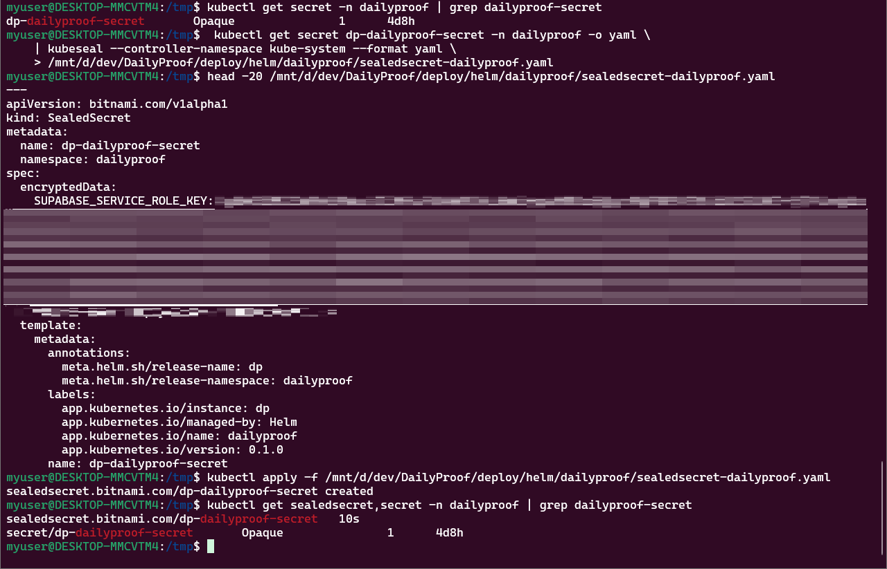

  SealedSecret 적용 후 클러스터에서 실제 Secret으로 복호화되어 생성된 화면

#### - 클러스터 정책 강제

런타임 보안은 Kyverno로 강제해 root 실행, `:latest` 태그 사용, capability 설정 누락, `readOnlyRootFilesystem` 미적용 같은 위험한 스펙이 배포 단계에서 차단되도록 했다.

  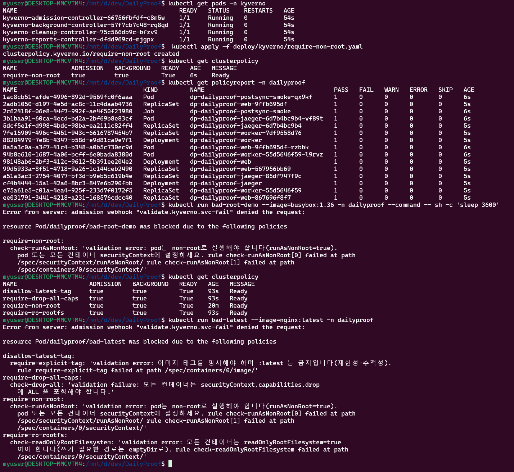

  여러 Kyverno 정책이 실제 워크로드 생성 시점에 적용되어 위험한 스펙을 거부한 화면

### (5) Recovery / Operations

- `/health/live`, `/health/ready`
- graceful shutdown
- backup + restore drill
- rollback runbook
- admin ops 페이지에서 failed/stuck job 확인 및 재처리

  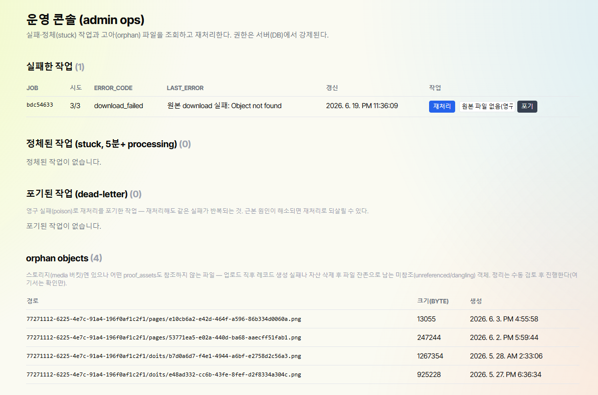

# 6. 프로젝트에서 보여준 포인트

- `web`과 `worker`를 분리해 서비스와 배치/상주 프로세스의 성격 차이를 드러냈다.
- 외부 broker 없이 Postgres queue(`FOR UPDATE SKIP LOCKED`)로 단순하면서 설명 가능한 구조를 만들었다.
- traceparent를 job row에 저장해 web 요청과 worker span을 하나의 trace로 이어 붙였다.
- 보안은 앱 레벨, 배포 레벨, 클러스터 정책 레벨까지 다층으로 구성했다.
- 장애를 실제로 재현하고, 로그·메트릭·트레이스로 원인을 추적하는 회고 문서를 남겼다.

# 7. 주요 산출물

- Dockerfile / docker-compose
- Helm chart / Terraform / ArgoCD 설정
- GitHub Actions / Jenkins pipeline
- OpenTelemetry / Prometheus / Grafana / Alertmanager / Jaeger
- Security checklist / threat model / Kyverno admission policy
- Runbook / rollback / backup-recovery / incident log
- 성능 테스트 결과 / troubleshooting retrospective

# 8. 사용 기술

| 구분 | 기술 |
|---|---|
| Front-End / App | Next.js 15, TypeScript, Tailwind CSS, FullCalendar, Tiptap |
| Backend / Data | Supabase, Postgres, RLS, Node worker |
| Container / Orchestration | Docker, Helm, k3s |
| GitOps / IaC | ArgoCD, Terraform |
| CI/CD | GitHub Actions, Jenkins |
| Observability | OpenTelemetry, Jaeger, Prometheus, Alertmanager, Grafana |
| Security | Kyverno, sealed-secrets, Trivy, gitleaks, CodeQL, Dependabot |

# 9. 문서

전체 문서 목록은 [`docs/README.md`](docs/README.md)에 정리했고, 여기서는 이직 회사가 처음 볼 때 읽기 좋은 순서로 추려서 연결했다.

- [target architecture](docs/architecture/target-architecture.md) : 이 프로젝트를 어떤 운영 구조로 확장했는지 한 번에 보여주는 핵심 문서
- [ArgoCD](docs/runbooks/argocd.md) : GitOps 동기화와 운영 방식, sync/rollback 흐름을 정리한 문서
- [k8s deploy](docs/runbooks/k8s-deploy.md) : Helm, k3s, 이미지 반영까지 실제 배포 흐름을 설명하는 문서
- [incident log](docs/incidents/incident-log.md) : 장애 재현, 탐지, 조치, 회고를 모아둔 문서
- [threat model](docs/security/threat-model.md) : 어떤 보안 위험을 가정했고 어떻게 줄였는지 정리한 문서
- [backup & recovery](docs/runbooks/backup-recovery.md) : 백업 전략과 실제 restore drill 결과를 보여주는 문서
- [worklog](docs/worklog.md) : 구현 순서, 주요 결정, 작업 이력을 시간순으로 정리한 문서

# 10. 프로젝트 후기

이 프로젝트는 단순히 기능을 추가한 앱이 아니라,  
`운영 중 발생할 수 있는 문제를 시나리오로 구성하고, 이에 대응하기 위해 넣은 구조와 설정이 실제로 동작하는지 직접 아키텍처를 설계하고 테스트`를 통해 직접 검증했다.

특히 아래 경험을 가장 강하게 보여준다.

- 비동기 파이프라인을 운영 구조로 연결한 경험
- 배포 자동화와 GitOps를 실제로 붙여본 경험
- 보안 정책을 코드와 클러스터 정책 양쪽에서 다룬 경험
- 장애를 재현하고 관측 도구로 원인을 추적한 경험
- 설계, 배포, 보안, 장애 대응 과정을 문서화하고 자료와 회고를 함께 남겨 실제 작업 흐름과 판단 근거를 정리한 경험
