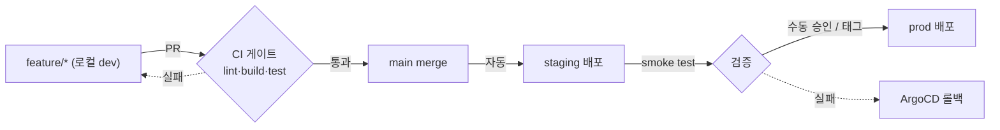

# 브랜치 전략 (Branching)

코드 작업을 본격적으로 시작하기 전에 **어떤 브랜치 모델로 일하고, main에 merge한 결과가 어떤 배포로 이어지는지**를 먼저 고정한다.
`environments.md`의 `dev → staging → prod` 흐름과 그대로 맞물리는 모델을 택한다.

기준일: 2026-06-10 · 전제: 로컬(k3s) 직접 구현, AWS는 [추후]

---

## 1. 먼저 정의하는 용어

- **환경 승격(promotion)**: 하나의 빌드/변경을 낮은 환경에서 검증하고, 통과하면 다음 환경으로 단계적으로 올리는 것.
  여기서는 `dev(로컬) → staging → prod` 순으로 올린다. 환경마다 다시 만드는 게 아니라 **같은 코드를 다음 단계로 통과시키는** 개념이다.
- **트렁크 기반(trunk-based)**: 모두가 `main`(트렁크) 하나에 아주 짧은 주기로 직접 커밋하고, 아직 완성되지 않은 기능은 **feature flag로 가려** 배포에서 분리하는 모델.
- **GitHub Flow**: `main`을 항상 배포 가능한 상태로 두고, 작업은 짧은 `feature/*` 브랜치에서 한 뒤 **PR → main merge**로 반영하는 모델.
- **Git Flow**: `develop`, `release/*`, `hotfix/*` 등 **여러 장수(long-lived) 브랜치**를 두고 릴리스를 관리하는 모델.

---

## 2. 후보 비교와 선택

| 모델 | 한 줄 요약 | 이 프로젝트에서 |
|------|-----------|----------------|
| **GitHub Flow + 환경 승격** | `main` 항상 배포 가능 + 짧은 `feature/*` → PR → merge, 그 merge가 환경 승격을 태움 | **채택** |
| 트렁크 기반 | `main`에 직접/초단명 커밋 + feature flag로 미완성 가림 | 보류 — feature flag 인프라가 아직 없음 |
| Git Flow | `develop`/`release/*` 등 장수 브랜치 다수 | 제외 — 1인·2주 범위에 과함 |

**GitHub Flow + 환경 승격을 택한 이유**

1. **환경 분리와 일치** — `environments.md`의 `dev → staging → prod` 승격 단계에 브랜치/배포 이벤트가 1:1로 대응한다.
2. **GitOps 전제와 맞음** — `main = 항상 배포 가능`이 ArgoCD·자동배포의 기본 가정과 같다.
3. **오버헤드 최소** — 1인·단기 작업이라 장수 브랜치를 관리할 이유가 없다.

**다른 후보를 뺀 이유**

- 트렁크 기반은 미완성 기능을 가릴 **feature flag 인프라가 아직 없고**, PR 리뷰·CI 통과를 증거로 남기는 포트폴리오 목적과도 덜 맞는다.
- Git Flow는 릴리스 캘린더도 없는 1인 작업에서 **장수 브랜치 관리 비용만** 늘린다.

---

## 3. 브랜치 구조

| 브랜치 | 수명 | 역할 |
|--------|------|------|
| `main` | 영구 | 항상 배포 가능한 단일 소스. 보호 브랜치(직접 push 금지, PR로만 반영) |
| `feature/*` | 단명 | 기능/수정 작업 단위. merge되면 삭제 |

작업 브랜치 명명:

```
feature/<범위>-<요약>      예) feature/async-pipeline
fix/<범위>-<요약>          예) fix/upload-mime-validation
docs/<요약>                예) docs/branching-strategy
chore/<요약>               예) chore/ci-node22
```

- 소문자 + 하이픈(kebab-case), 범위를 앞에 둬서 정렬·검색이 쉽게.
- 한 브랜치 = 한 관심사. 리뷰 가능한 작은 단위로 유지하고 merge 후 삭제한다.

---

## 4. 흐름 (feature → main → 배포)



1. `main`에서 `feature/*`를 분기해 로컬 dev에서 작업한다.
2. PR을 올리면 **CI 게이트**(lint·build·test)를 통과해야 merge할 수 있다.
3. `main`에 merge되면 **staging으로 자동 배포**된다.
4. staging smoke test가 통과하면 **prod로 승격**한다(GitHub Environment 수동 승인 또는 `vX.Y.Z` 태그).
5. 문제가 생기면 **ArgoCD로 직전 정상 리비전으로 롤백**한다.

---

## 5. PR / merge 규칙

- **PR 필수** — `main` 직접 push 금지. 모든 변경은 PR을 거친다.
- **CI 게이트** — lint·build·test가 모두 통과(green)해야 merge 가능.
- **merge 방식** — squash merge로 `main` 히스토리를 `1 PR = 1 커밋`으로 선형 유지.
- **merge 후 정리** — 단명 브랜치는 merge와 함께 삭제.
- **커밋 메시지** — Conventional Commits(`feat:`/`fix:`/`docs:`/`chore:`/`refactor:`). 기능 식별은 메시지·PR로 하고, 일자성 라벨은 쓰지 않는다.

> CI 게이트 · prod 승인 · ArgoCD 롤백은 각각 GitHub Actions / GitHub Environment / ArgoCD 구축 단계에서 실제 연결된다. 이 문서는 그 단계들이 따를 **합의된 규칙**을 먼저 고정해 두는 것이다.

---

## 6. 환경 분리와의 매핑

| 단계 | 브랜치/이벤트 | 배포 대상 | 게이트 |
|------|---------------|-----------|--------|
| 개발 | `feature/*` (로컬) | dev (로컬) | 없음 |
| 통합 | PR → `main` | — | CI(lint·build·test) |
| 검증 | `main` merge | staging | 자동배포 후 smoke test |
| 출시 | 수동 승인 / `vX.Y.Z` 태그 | prod | GitHub Environment 승인 |
| 복구 | (배포 리비전) | staging/prod | ArgoCD 롤백 |

`environments.md`의 배포 트리거(dev 수동 / staging 자동 / prod 수동 승인)와 1:1로 대응한다.

---

## 7. 적용

- 이 문서 채택 이후 모든 코드 작업은 `feature/*`에서 진행하고 PR로 `main`에 반영한다.
- 첫 작업 브랜치는 `feature/async-pipeline` — proof_assets/jobs 스키마부터 업로드→job 생성 흐름까지의 비동기 파이프라인 작업 단위.
- 브랜치 보호 · CI 게이트 · prod 승인 같은 자동화는 해당 인프라 구축 단계에서 위 규칙에 맞춰 설정한다.
