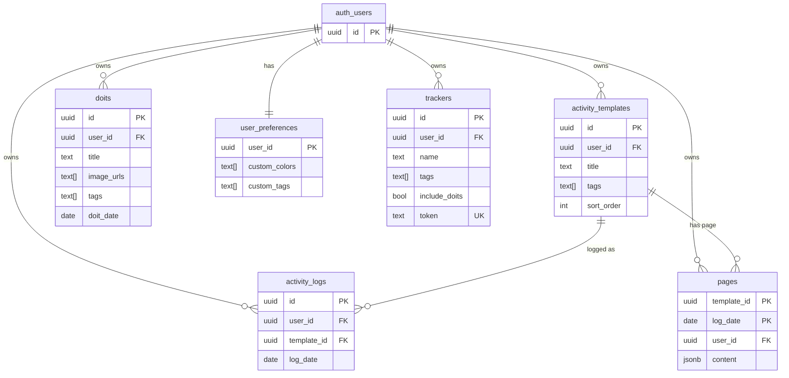
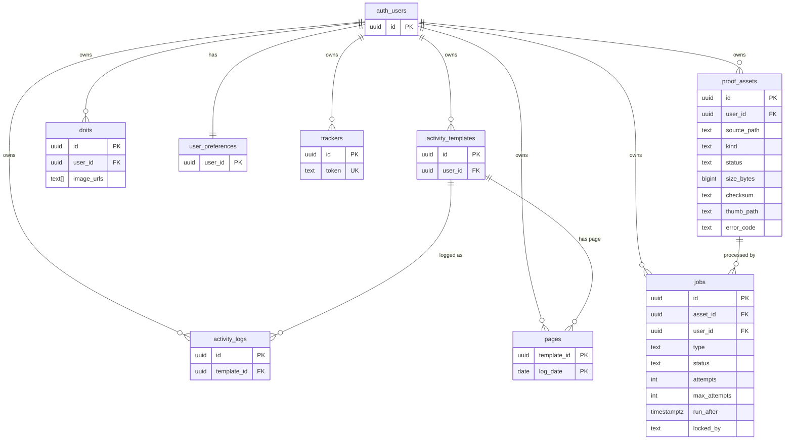

# 데이터 모델 (ERD)

`supabase/schema.sql`을 source of truth로 하는 DB 구조를 ERD로 남긴다.
비동기 파이프라인(proof_assets/jobs) **통합 전 → 통합 후**를 나란히 둬서 이번 변경으로 무엇이 추가됐는지 보이게 한다.

기준일: 2026-06-10 · 원본: `supabase/schema.sql`

> ERD는 스크린샷이 아니라 **다이어그램 as 코드**(mermaid)로 둔다. git에 추적돼 변화가 커밋 diff로 남고, GitHub/Notion에서 그대로 렌더된다. `auth_users`는 Supabase 내장 `auth.users`를 가리킨다(우리 스키마 밖, 모든 테이블의 소유자 FK 대상).

---

## 1. 통합 전 (기존 6개 테이블)

습관/기록 도메인. 모든 사용자 데이터는 `auth.users` 소유로 RLS owner-only가 걸린다.

요약: 활동 정의(`activity_templates`) ↔ 날짜별 기록(`activity_logs`)·페이지(`pages`), 일회성 기록(`doits`), 사용자 설정(`user_preferences`), 외부 임베드용 잔디 정의(`trackers`). 이미지 업로드는 `doits.image_urls`(text 경로 배열)로만 들고 있고 **처리 상태/메타데이터 개념이 없다.**

---

## 2. 통합 후 (+ proof_assets, jobs)

업로드 자산의 처리 상태 모델(`proof_assets`)과 후처리 작업 큐(`jobs`)를 추가했다. 두 테이블이 비동기 파이프라인의 핵심이다.

### 추가된 두 테이블

- **proof_assets** — 업로드 자산 1건의 처리 상태와 후처리 결과.
  - 상태: `uploaded → processing → ready | failed` (failed → processing 재처리).
  - 메타데이터(content_type/size/width/height/checksum/thumb_path)는 worker 후처리로 채워진다.
  - `kind in ('doits','pages')`로 업로드 맥락을 표시하지만, `doits`/`pages`와 **FK로 직접 묶지 않는다**(자산은 스토리지 객체 기준으로 독립 추적, 느슨한 결합).
- **jobs** — 자산당 후처리 작업 큐(외부 브로커 없이 DB 큐 + polling).
  - `attempts`/`max_attempts`(재시도), `run_after`(백오프), `locked_at`/`locked_by`(선점).
  - `proof_assets`와 `asset_id` FK로 1:N. `user_id`는 RLS·필터용 비정규화.

### 무엇이 달라졌나

| 구분 | 통합 전 | 통합 후 |
|------|---------|---------|
| 업로드 표현 | `doits.image_urls` text 경로 배열 | `proof_assets` 행으로 **상태·메타데이터 추적** |
| 비동기 처리 | 없음(동기) | `jobs` 큐 + `claim_job`(FOR UPDATE SKIP LOCKED) |
| 운영 지표 | 없음 | `jobs` 상태로 `queue_depth`·실패율 측정 가능 |
| 접근 제어 | RLS owner-only | 동일 + worker는 `service_role`로 우회, `claim_job`은 `service_role`에만 grant |

---

## 3. 적용 / 증거

- 적용: Supabase SQL Editor에서 `schema.sql` 실행(멱등, 신규 객체만 추가).
- 보조 스샷(`docs/screenshots/`, git 미추적): `004-db-tables-before-20260610.svg`(전) / `005-db-tables-after-20260610.svg`(후) — Supabase Schema Visualizer export.
- 본 ERD가 구조의 source of truth이고, 스샷은 시각 보조다.
