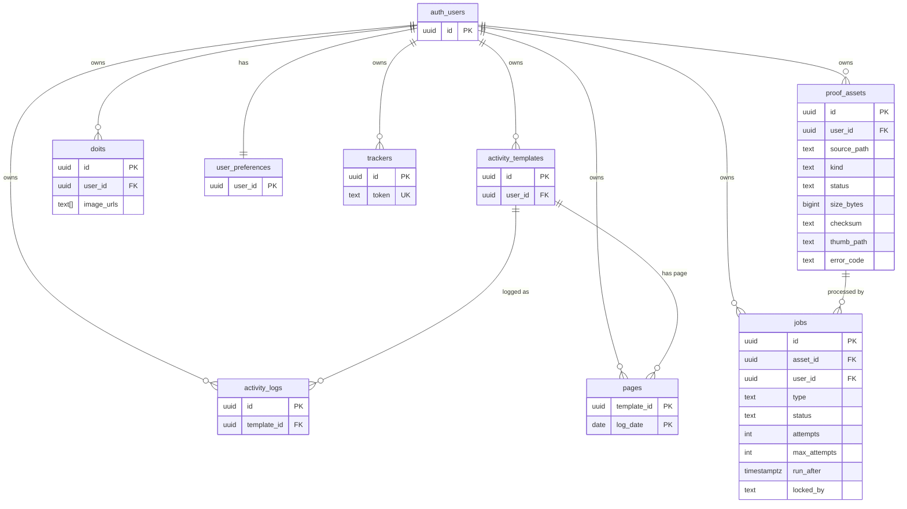

# ERD — 추가 후 (+ proof_assets, jobs)

비동기 파이프라인 통합 **후**의 DB 구조.
업로드 자산의 처리 상태 모델(`proof_assets`)과 후처리 작업 큐(`jobs`)를 추가했다. 두 테이블이 파이프라인의 핵심이다.

기준: `supabase/schema.sql` · 짝 문서: [erd-before.md](./erd-before.md)

> `auth_users`는 Supabase 내장 `auth.users`를 가리킨다.

## 추가된 두 테이블

- **proof_assets** — 업로드 자산 1건의 처리 상태와 후처리 결과.
  - 상태: `uploaded → processing → ready | failed` (failed → processing 재처리).
  - 메타데이터(content_type/size/width/height/checksum/thumb_path)는 worker 후처리로 채워진다.
  - `kind in ('doits','pages')`로 업로드 맥락을 표시하지만, `doits`/`pages`와 **FK로 직접 묶지 않는다**(자산은 스토리지 객체 기준으로 독립 추적, 느슨한 결합).
  - **CHECK 제약(서버측 검증)**: `content_type`은 `image/%`, `size_bytes`는 8MB 이하. media 버킷의 `file_size_limit`/`allowed_mime_types`와 짝이 되는 record-level 게이트.
- **jobs** — 자산당 후처리 작업 큐(외부 브로커 없이 DB 큐 + polling).
  - `attempts`/`max_attempts`(재시도), `run_after`(백오프), `locked_at`/`locked_by`(선점).
  - `proof_assets`와 `asset_id` FK로 1:N. `user_id`는 RLS·필터용 비정규화.
  - **자동 enqueue**: `proof_assets` insert 시 트리거 `enqueue_proof_job`이 `process_image` job 1건을 생성한다(asset:job = 1:1, 클라이언트는 asset만 넣고 job 생성은 DB가 책임).

## 무엇이 달라졌나

| 구분 | 통합 전 | 통합 후 |
|------|---------|---------|
| 업로드 표현 | `doits.image_urls` text 경로 배열 | `proof_assets` 행으로 **상태·메타데이터 추적** |
| 비동기 처리 | 없음(동기) | `jobs` 큐 + `claim_job`(FOR UPDATE SKIP LOCKED) |
| 운영 지표 | 없음 | `jobs` 상태로 `queue_depth`·실패율 측정 가능 |
| 접근 제어 | RLS owner-only | 동일 + worker는 `service_role`로 우회, `claim_job`은 `service_role`에만 grant |
