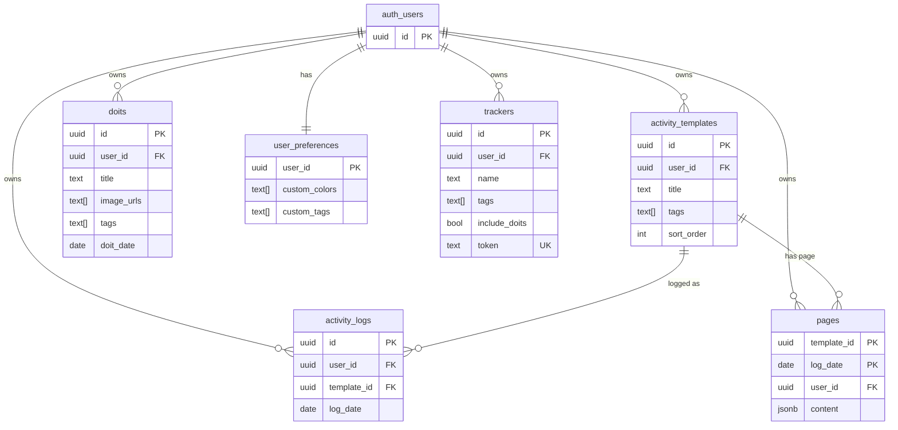

# ERD — 통합 전 (기존 6개 테이블)

비동기 파이프라인(proof_assets/jobs) 통합 **전**의 DB 구조.
습관/기록 도메인이며, 모든 사용자 데이터는 `auth.users` 소유로 RLS owner-only가 걸린다.

기준: `supabase/schema.sql` · 짝 문서: [erd-after.md](./erd-after.md)

> `auth_users`는 Supabase 내장 `auth.users`(우리 스키마 밖, 모든 소유 FK의 대상)를 가리킨다.

요약: 활동 정의(`activity_templates`) ↔ 날짜별 기록(`activity_logs`)·페이지(`pages`), 일회성 기록(`doits`), 사용자 설정(`user_preferences`), 외부 임베드용 잔디 정의(`trackers`). 이미지 업로드는 `doits.image_urls`(text 경로 배열)로만 들고 있고 **처리 상태/메타데이터 개념이 없다.**
