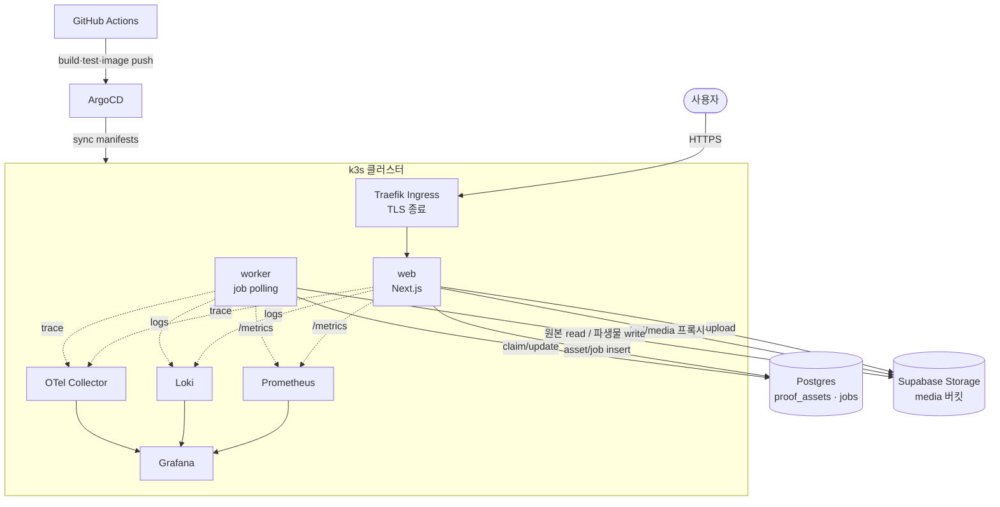
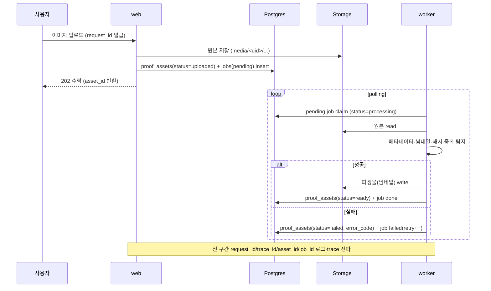
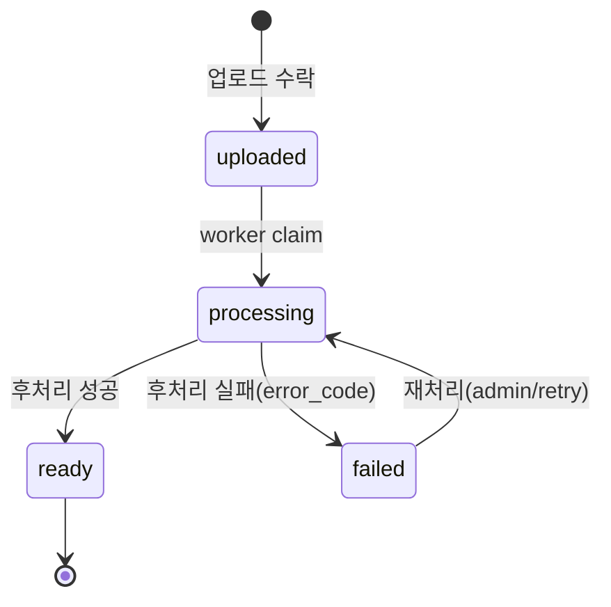

# 목표 아키텍처 (Target Architecture)

Gap 분석에서 ✅직접/🔶혼합으로 분류한 항목을 하나의 운영 흐름으로 묶은 **목표 구조**와 **핵심 시나리오**를 정의한다.
모든 항목을 이 한 흐름(업로드 → worker 후처리 → 관측 → 배포)에 연결하는 것이 목표다.

기준일: 2026-06-09 · 전제: 로컬(WSL2) 직접 구현, AWS는 [추후] 문서 매핑

---

## 1. 한 줄 정의

> 사용자가 이미지를 업로드하면 **web**이 자산/작업 레코드를 만들고, **worker**가 비동기로 후처리(메타데이터·썸네일·해시·중복 탐지)해 상태를 전이시키며, 운영자는 **admin**과 **관측 스택(로그·메트릭·트레이스)**으로 전체 흐름을 보고, **GitOps(k3s + ArgoCD)**로 배포·롤백하는 서비스.

---

## 2. 서비스 구성

| 컴포넌트 | 역할 | 비고 |
|----------|------|------|
| `web` (Next.js) | 사용자 요청, 업로드 수락, asset/job 생성, admin ops, `/health`·`/metrics` 노출 | 기존 앱 확장 |
| `worker` | job table polling → 후처리 → 상태 전이·결과 저장 | 신규(✅ 직접) |
| `queue` | 비동기 작업 전달 = **DB job table + polling** | 외부 브로커(Redis/SQS) 없이 단순화 |
| `storage` | 이미지 원본/파생물 저장 (Supabase Storage `media`) | 기존 |
| `database` | Postgres. 기존 6개 테이블 + `proof_assets`/`jobs` | 메타데이터·상태 관리 |
| `observability` | Prometheus(메트릭) · Grafana(시각화) · Loki(로그) · OTel(트레이스) | 신규(✅ 직접) |
| `ingress` | k3s Traefik ingress, TLS 종료, 라우팅 | 네트워크 경계 |
| `gitops` | ArgoCD가 manifest repo를 sync, revision rollback | 신규(✅ 직접) |
| `ci/cd` | GitHub Actions build/test/image push/deploy | 신규(✅ 직접) |

---

## 3. 아키텍처 다이어그램

---

## 4. 핵심 시나리오 (업로드 → 후처리 → 관측)

운영자 흐름:

- admin ops 페이지에서 `failed`/stuck job 조회 → 재처리 트리거.
- Grafana에서 `upload_total`, `job_queue_depth`, `job_processing_seconds`, `media_proxy_latency` 확인.
- 장애 재현 시 로그(Loki) + 메트릭(Prometheus) + 트레이스(OTel)로 원인 추적.

### 4.1 이 시나리오를 고른 이유

이 시나리오의 목적은 **이미지 처리 기능 자체가 아니라, 운영(DevOps)에서 보여줄 문제를 의도적으로 만들어내는 것**이다. 단순 CRUD 앱은 비동기·적체·실패·스케일 포인트가 없어 관측·장애·확장 이야기를 만들 수 없다. DailyProof가 이미 가진 업로드 위에 worker 파이프라인을 얹으면 최소 비용으로 운영 소재가 생긴다.

따라서 worker의 처리 로직(썸네일·해시 등)은 가볍게만 구현하고, 노력과 서술의 초점은 그 주변 운영(배포·관측·장애·스케일)에 둔다. 즉 주인공은 "이미지 앱"이 아니라 **"비동기 파이프라인을 운영한 경험"**이다.

| 시나리오 요소(수단) | 의도(보여주려는 것) | 결과(만들어지는 운영 소재) |
|----------------------|----------------------|-----------------------------|
| web ↔ worker 분리 | 멀티 컴포넌트 운영 | 멀티 컨테이너, K8s 별도 배포, worker만 HPA 스케일 |
| DB job table 큐 | 비동기·백프레셔 | `queue_depth` 메트릭, 큐 적체 장애 재현 |
| 상태 전이(stuck/failed) | 실패 복구·재처리 | admin에서 stuck/failed 조회·재처리, stuck job 장애 |
| 수락↔ready 지연 | 지연 관측·SLO | latency 측정, 트레이스로 web→worker→DB 구간 추적 |
| worker 다운/메모리 부족 | 장애 복구 | pod 재시작 장애, 복구 runbook |
| staging→smoke→prod | 안전 배포 | 배포 자동화 + 롤백 시연(ArgoCD revision) |

---

## 5. 자산 상태 전이 (`proof_assets`)

이 상태 모델이 비동기 파이프라인·재처리·실패 복구·운영 가시성의 근거가 된다. (상세 스키마는 Day1-7)

---

## 6. 관측성·네트워크 경계 (요약)

- **메트릭**: web/worker가 `/metrics` 노출 → Prometheus scrape → Grafana 대시보드.
- **로그**: web/worker 공통 JSON 로그(`request_id`·`trace_id`·`user_id`·`asset_id`·`job_id`·`error_code`) → Loki.
- **트레이스**: OTel로 web 요청 → worker → DB까지 span 전파.
- **네트워크**: 사용자 → Traefik ingress(TLS 종료) → web service → pod. body size 제한·upstream timeout·keep-alive는 ingress/앱에서 명시(상세는 `network.md`, Day13).

---

## 7. [추후 AWS] 매핑 (문서 전용)

| 컴포넌트 | 로컬(이번 구현) | AWS(추후) |
|----------|------------------|-----------|
| web/worker | k3s Deployment | EKS Deployment |
| queue | DB job table | DB job table 유지 또는 SQS |
| storage | Supabase Storage | S3 |
| database | Supabase Postgres | RDS PostgreSQL 또는 현행 유지 |
| ingress/tls | Traefik | ALB + ACM |
| secret | K8s Secret | Secrets Manager / SSM |
| metric/log | Prometheus/Grafana/Loki | CloudWatch 병행 |

stateless 컨테이너·외부 시크릿 주입·object storage 분리를 유지해 이전성을 확보한다.

---

## 8. 다음 작업

- [Day1-6] `architecture/environments.md` — dev/staging/prod 환경 분리 전략
- [Day1-7] `proof_assets`/`jobs` DB 스키마 초안
- [Day1-8] `plan/roadmap.md` — 위 구조를 14일 일정으로 묶기
