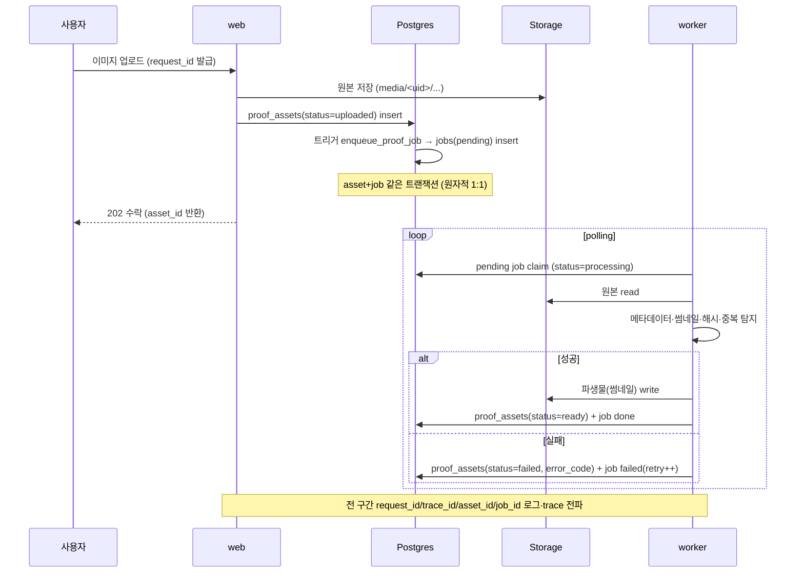
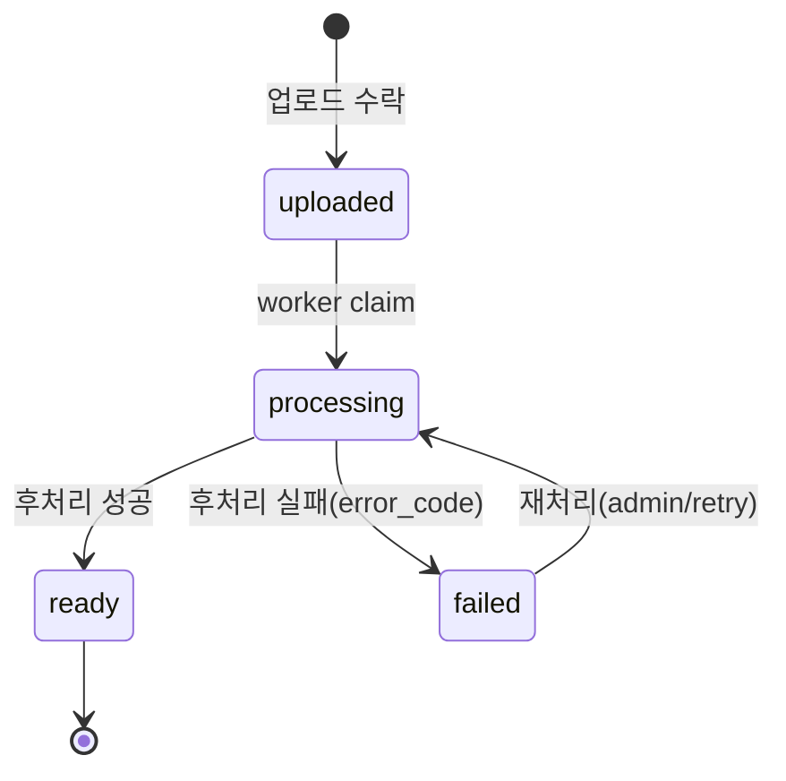
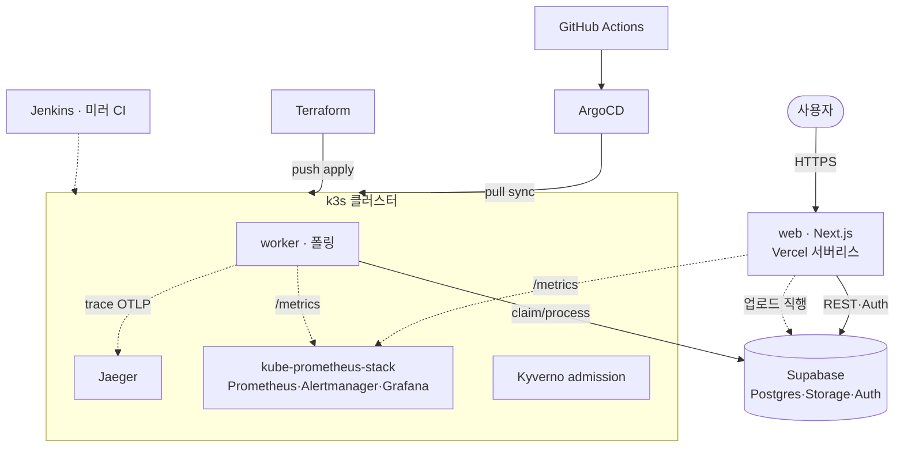

# 목표 아키텍처 (Target Architecture)

Gap 분석에서 ✅직접/🔶혼합으로 분류한 항목을 하나의 운영 흐름으로 묶은 **목표 구조**와 **핵심 시나리오**를 정의한다.
모든 항목을 이 한 흐름(업로드 → worker 후처리 → 관측 → 배포)에 연결하는 것이 목표다.

기준일: 2026-06-09 · 전제: 로컬(WSL2) 직접 구현, AWS는 [추후] 문서 매핑

> 📌 이 문서는 **착수 시점(06-09)의 목표 설계**다. 2주 구현을 마친 **실제 결과와 계획 대비 변경점**은 아래 **[§9 구현 결과](#9-구현-결과-계획-대비)** 에 정리했다(목표는 그대로 두고 결과를 덧붙임).

---

## 1. 한 줄 정의

> 사용자가 이미지를 업로드하면 **web**이 자산/작업 레코드를 만들고, **worker**가 비동기로 후처리(메타데이터·썸네일·해시·중복 탐지)해 상태를 전이시키며, 운영자는 **admin**과 **관측 스택(로그·메트릭·트레이스)**으로 전체 흐름을 보고, **GitOps(k3s + ArgoCD)**로 배포·롤백하는 서비스.

---

## 2. 서비스 구성

| 컴포넌트 | 역할 | 비고 |
|----------|------|------|
| `web` (Next.js) | 사용자 요청, 업로드 수락, asset/job 생성, admin ops, `/health`·`/metrics` 노출 | 기존 앱 확장 |
| `worker` | job table polling → 후처리 → 상태 전이·결과 저장 | 신규(✅ 직접) |
| `queue` | 비동기 작업 전달 = **DB job table + polling** | 외부 브로커(Redis/SQS) 없이 단순화 |
| `storage` | 이미지 원본/파생물 저장 (Supabase Storage `media`) | 기존 |
| `database` | Postgres. 기존 6개 테이블 + `proof_assets`/`jobs` | 메타데이터·상태 관리 |
| `observability` | Prometheus(메트릭) · Grafana(시각화) · Loki(로그) · OTel(트레이스) | 신규(✅ 직접) |
| `ingress` | k3s Traefik ingress, TLS 종료, 라우팅 | 네트워크 경계 |
| `gitops` | ArgoCD가 manifest repo를 sync, revision rollback | 신규(✅ 직접) |
| `ci/cd` | GitHub Actions build/test/image push/deploy | 신규(✅ 직접) |

---

## 3. 아키텍처 다이어그램

---

## 4. 핵심 시나리오 (업로드 → 후처리 → 관측)

운영자 흐름:

- admin ops 페이지에서 `failed`/stuck job 조회 → 재처리 트리거.
- Grafana에서 `upload_total`, `job_queue_depth`, `job_processing_seconds`, `media_proxy_latency` 확인.
- 장애 재현 시 로그(Loki) + 메트릭(Prometheus) + 트레이스(OTel)로 원인 추적.

### 4.1 이 시나리오를 고른 이유

이 시나리오의 목적은 **이미지 처리 기능 자체가 아니라, 운영(DevOps)에서 보여줄 문제를 의도적으로 만들어내는 것**이다. 단순 CRUD 앱은 비동기·적체·실패·스케일 포인트가 없어 관측·장애·확장 이야기를 만들 수 없다. DailyProof가 이미 가진 업로드 위에 worker 파이프라인을 얹으면 최소 비용으로 운영 소재가 생긴다.

따라서 worker의 처리 로직(썸네일·해시 등)은 가볍게만 구현하고, 노력과 서술의 초점은 그 주변 운영(배포·관측·장애·스케일)에 둔다. 즉 주인공은 "이미지 앱"이 아니라 **"비동기 파이프라인을 운영한 경험"**이다.

| 시나리오 요소(수단) | 의도(보여주려는 것) | 결과(만들어지는 운영 소재) |
|----------------------|----------------------|-----------------------------|
| web ↔ worker 분리 | 멀티 컴포넌트 운영 | 멀티 컨테이너, K8s 별도 배포, worker만 HPA 스케일 |
| DB job table 큐 | 비동기·백프레셔 | `queue_depth` 메트릭, 큐 적체 장애 재현 |
| 상태 전이(stuck/failed) | 실패 복구·재처리 | admin에서 stuck/failed 조회·재처리, stuck job 장애 |
| 수락↔ready 지연 | 지연 관측·SLO | latency 측정, 트레이스로 web→worker→DB 구간 추적 |
| worker 다운/메모리 부족 | 장애 복구 | pod 재시작 장애, 복구 runbook |
| staging→smoke→prod | 안전 배포 | 배포 자동화 + 롤백 시연(ArgoCD revision) |

---

## 5. 자산 상태 전이 (`proof_assets`)

이 상태 모델이 비동기 파이프라인·재처리·실패 복구·운영 가시성의 근거가 된다. (worker 처리·상태 전이·운영 상세는 `worker.md`)

---

## 6. 관측성·네트워크 경계 (요약)

- **메트릭**: web/worker가 `/metrics` 노출 → Prometheus scrape → Grafana 대시보드.
- **로그**: web/worker 공통 JSON 로그(`request_id`·`trace_id`·`user_id`·`asset_id`·`job_id`·`error_code`) → Loki.
- **트레이스**: OTel로 web 요청 → worker → DB까지 span 전파.
- **네트워크**: 사용자 → Traefik ingress(TLS 종료) → web service → pod. body size 제한·upstream timeout·keep-alive는 ingress/앱에서 명시(상세는 `network.md`, 추후).

---

## 7. [추후 AWS] 매핑 (문서 전용)

| 컴포넌트 | 로컬(이번 구현) | AWS(추후) |
|----------|------------------|-----------|
| web/worker | k3s Deployment | EKS Deployment |
| queue | DB job table | DB job table 유지 또는 SQS |
| storage | Supabase Storage | S3 |
| database | Supabase Postgres | RDS PostgreSQL 또는 현행 유지 |
| ingress/tls | Traefik | ALB + ACM |
| secret | K8s Secret | Secrets Manager / SSM |
| metric/log | Prometheus/Grafana/Loki | CloudWatch 병행 |

stateless 컨테이너·외부 시크릿 주입·object storage 분리를 유지해 이전성을 확보한다.

---

## 8. 다음 작업 (착수 시점 기준)

- `architecture/environments.md` — dev/staging/prod 환경 분리 전략
- `proof_assets`/`jobs` DB 스키마 초안

---

## 9. 구현 결과 (계획 대비)

착수 시점(§1~8)의 목표 대비, 2주 구현으로 **실제 무엇이 만들어졌고 어디가 달라졌는지** 정리한다. (검증 기준일 2026-06-22)

### 9.1 실제 배포 토폴로지

핵심 변경: web과 worker가 **다른 환경에 분리 배포**된다. web은 서버리스(Vercel), worker는 상주 폴링이라 k3s. (근거: `environments.md`, `README.md`)

- **web = Vercel**(또는 k3s), **worker = k3s**. Vercel 단독 시 업로드는 되지만 후처리(worker)는 미동작 — 의도된 분리(`environments.md` §3.1).
- k3s 차트(`deploy/helm/dailyproof/templates/`)에 web·worker 외에 jaeger·monitoring·networkpolicy·postsync-smoke 등 13개 매니페스트, 대부분 `*.enabled` 토글.

### 9.2 계획 vs 실제 (관측·배포)

| 영역 | 계획(§2·§6) | 실제 구현 |
|---|---|---|
| **트레이스** | OTel Collector → (Tempo) | **Jaeger all-in-one로 직접 OTLP export**(Collector 없음). web/worker 서비스명 분리, k8s `jaeger.yaml`, in-memory 저장(데모). Tempo는 [추후] |
| **메트릭** | Prometheus·Grafana | **kube-prometheus-stack**(Prometheus+Alertmanager+Grafana) 연동. 차트에 ServiceMonitor·PrometheusRule(`monitoring.yaml`, 토글), 배포 시 활성화 |
| **로그** | Loki | **JSON stdout 구조만 완성, Loki는 미배포**([추후]). 필드(request_id·trace_id·job_id 등)는 Loki 연동 준비됨 |
| **GitOps/IaC** | ArgoCD + GitHub Actions | + **Jenkins**(미러 CI) · **Terraform**(helm_release push IaC) · **PostSync smoke**(배포 후 health·metrics 검증) |
| **배포 경로** | k3s | web=Vercel / worker·관측·보안=k3s(ArgoCD pull + Terraform push 둘 다) |

실제 메트릭: `dailyproof_jobs_total`·`dailyproof_assets_total`·`dailyproof_job_processing_seconds_avg`(게이지) + `dailyproof_security_events_total`(counter). 보안 알림: `SecurityRateLimitSpike`·`SecurityForbiddenSpike`·`SecurityUnauthorizedSpike`.

### 9.3 계획에 없던 추가 — 보안 (가장 크게 확장)

착수 설계엔 보안이 거의 없었으나, 구현 단계에서 **예방·강제·탐지 다층 보안**을 추가했다. (상세: [security/checklist.md](../security/checklist.md), [threat-model.md](../security/threat-model.md), [admission-control.md](../security/admission-control.md))

| 계층 | 통제 |
|---|---|
| **앱(API)** | zod 입력 검증, source_path 소유 검증(403), rate limit(grass IP 60/분·proof-assets uid 30/분, 429) |
| **웹/응답** | Security headers(HSTS·nosniff·X-Frame·Referrer·Permissions), **CSP nonce(enforce)**, X-Powered-By 제거, cookie/CSRF(allowedOrigins) |
| **데이터** | Storage 버킷 MIME·8MB 강제, RLS owner-only, **sealed-secrets**(암호화 커밋) |
| **인프라(k8s)** | **NetworkPolicy** default-deny, securityContext 하드닝, **Kyverno** admission 4정책(non-root·ro-rootfs·drop ALL·latest 금지) |
| **CI(예방)** | 보안 스캐닝 hard gate — gitleaks·trivy(CVE·IaC·secret), CodeQL(SAST)·Dependabot·SBOM |
| **탐지** | 보안 이벤트 계측 → Prometheus 알림 firing → Alertmanager |

### 9.4 계획에 없던 추가 — 운영 영역

- **확장성**([scaling.md](scaling.md)): 병목 순서 분석 + web HPA(CPU)·worker KEDA(큐 깊이) 매니페스트.
- **비용**([cost.md](cost.md)) · **백업·복구**([backup-recovery.md](../runbooks/backup-recovery.md), 복원 드릴 실측) · **롤백**([rollback.md](../runbooks/rollback.md)).
- **CI/CD**: GitHub Actions(quality·e2e·manifests·images) + 보안 스캐닝 + Jenkins 미러 + e2e(Playwright).

### 9.5 잔여·후속 (정직한 한계)

- **Loki 미배포** — 로그는 stdout, 수집은 [추후].
- **OTel Collector·Tempo** — 현재 Jaeger 직접/in-memory(데모), 운영 백엔드는 [추후].
- **service_role 키 회전** — 과거 노출 이력(보안 작업), 회전 필요.
- **분산 rate limit / FQDN egress / 이미지 서명(cosign) / Kyverno HA** — 단일 노드 데모 한계, 후속.
- 트러블슈팅 과정은 `retrospective/`(회고 20편)에 서술.
