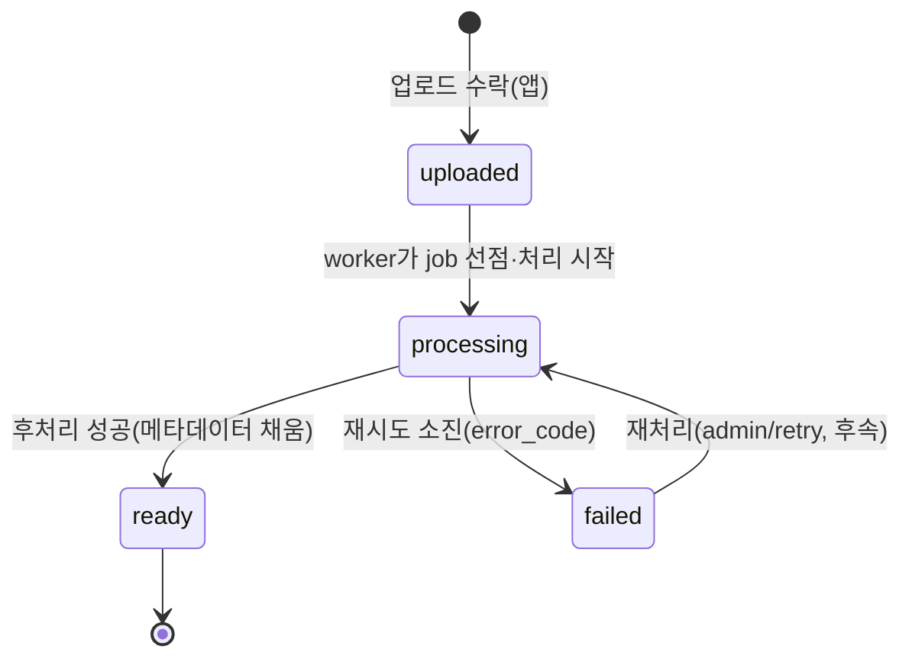
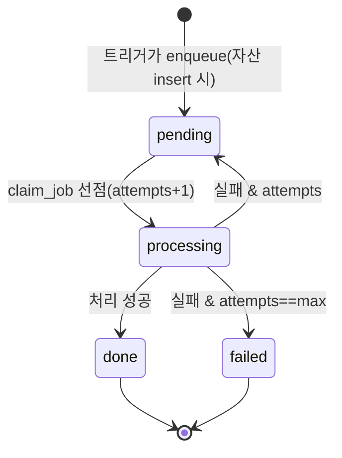

# 후처리 worker (상태 전이 · 운영)

`jobs` 큐를 소비하는 독립 Node 프로세스(`worker/worker.mjs`). `service_role` 키로 접속해 RLS를 우회하고, `claim_job`으로 한 번에 한 job을 안전하게 선점해 처리한다. 지금은 로컬에서 `npm run worker`로 실행하고, 추후 컨테이너화해 k3s에 별도 Deployment로 올린다(큐 적체 기반 HPA).

기준: `worker/worker.mjs`, `supabase/schema.sql`(`proof_assets`/`jobs`/`claim_job`)

---

## 1. 상태 전이

**자산(`proof_assets`)** — 업로드된 자산의 처리 상태.



**작업(`jobs`)** — 자산당 후처리 작업의 수명주기.



---

## 2. 처리 흐름 (성공 경로)

1. `claim_job(worker_id)`으로 `pending` job 1건 선점 → job `processing`(attempts+1).
2. 자산 `processing` 표시 → `source_path`로 media 원본 download.
3. 후처리(가볍게): **sha256 checksum · 실제 size · 차원**(PNG IHDR / JPEG SOF 파싱, 의존성 없음).
4. `proof_assets`에 메타데이터 채우고 `ready`, job `done`.

> 후처리 로직은 의도적으로 가볍게 둔다(시나리오 원칙). 노력은 그 주변 운영(재시도·관측·스케일·장애복구)에 집중한다. 썸네일 생성·적극적 중복 차단은 후속.

---

## 3. 동시성 · 폴링

- **동시성**: `claim_job`은 `FOR UPDATE SKIP LOCKED`로 한 행을 잠그고 가져온다 → **여러 worker를 띄워도 같은 job을 잡지 않는다**(수평 확장 안전, 추후 HPA로 worker 수를 큐 적체에 맞춰 늘림).
- **폴링**: 외부 브로커 없이 DB 큐를 주기적으로 폴링. 빈 큐면 `WORKER_POLL_IDLE_MS`(기본 2000ms)만큼 쉬고 다시 조회.
- `claim_job`은 `RETURNS public.jobs`라 빈 큐에서 NULL을 반환하고 PostgREST가 이를 "전 컬럼 null인 한 행"으로 표현 → worker는 `job.id`로 실제 선점 여부를 판별한다.

---

## 4. 실패 처리 (재시도 · 백오프 · error_code)

처리가 실패하면 `handleFailure`가 분기한다(`attempts`는 `claim_job`이 선점 시 이미 +1 한 값).

- **재시도** (`attempts < max_attempts`): job을 `pending`으로 되돌리고 잠금 해제, `run_after = now + RETRY_BASE_MS × 2^(attempts-1)`(지수 백오프). 같은 폴링이 그 시점 이후 자연히 다시 집어간다(별도 스케줄러 불필요).
- **확정 실패** (`attempts == max_attempts`): job·자산 모두 `failed`로 확정하고 `error_code`/`error_message`/`last_error` 기록.

`max_attempts` 기본 3 → 최대 3회 시도 후 failed. 기본 백오프(base 5s): 1차 실패→5s, 2차→10s, 3차→failed.

**error_code**

| 코드 | 의미 |
|------|------|
| `download_failed` | media에서 원본 download 실패(파일 없음/접근 실패 등) |
| `asset_not_found` | job이 가리키는 자산 행이 없음 |
| `unknown` | 그 외 분류되지 않은 오류 |

---

## 5. graceful shutdown

`SIGTERM`/`SIGINT` 수신 시 폴링 루프를 멈추되 **진행 중인 job은 마무리한 뒤 종료**한다(작업 중간 절단 방지). k3s가 pod를 종료(SIGTERM)할 때 안전하게 빠지기 위한 대비.

---

## 6. 실행 · 환경변수

```bash
npm run worker   # = node --env-file=.env.local worker/worker.mjs (Node 20.6+)
```

`.env.local`(앱과 공용, git 미추적)에 필요한 값:

| 변수 | 필수 | 설명 |
|------|------|------|
| `SUPABASE_URL` (또는 `NEXT_PUBLIC_SUPABASE_URL`) | ○ | 프로젝트 URL(앱 값 재사용) |
| `SUPABASE_SERVICE_ROLE_KEY` | ○ | **서버 전용 시크릿**. RLS 우회. 절대 커밋 금지 |
| `WORKER_POLL_IDLE_MS` | | 빈 큐 폴링 간격(기본 2000) |
| `WORKER_RETRY_BASE_MS` | | 지수 백오프 기준(기본 5000) |
| `APP_ENV` / `LOG_LEVEL` | | 로그 라벨 / 레벨 |

---

## 7. 로그

구조화 JSON 한 줄(`worker_id`·`job_id`·`asset_id`·`error_code` 등). 주요 메시지: `worker 시작`, `job 선점`, `job 완료`, `job 실패 — 재시도 예약`, `job 실패 — 최대 재시도 초과, failed 확정`, `claim_job 실패`, `worker 종료 완료`. (web과의 공통 로거 통합은 추후.)

---

## 8. 후속 / 운영 메모

- **stuck job 회수**: worker가 처리 중 죽으면 job이 `processing`+`locked_at`인 채 남는다. `locked_at`이 오래된 job을 `pending`으로 되돌리는 회수 로직은 후속.
- **컨테이너화 → k3s**: 추후 Docker 이미지로 묶어 별도 Deployment로 배포, 큐 적체 기반 HPA.
- **검증 중 발견(운영 함정)**: `.env.local`의 service_role 키가 잘리면 `claim_job`이 `Invalid API key`로 계속 실패한다. worker는 죽지 않고 폴링을 재시도하므로(복원력) 설정 오류가 가려질 수 있다 → 키 형식(JWT: 길이 ~200·점 2개)을 점검한다.
